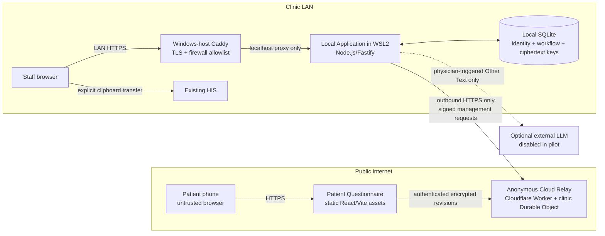

# Technical Architecture

Status: accepted design; application implementation has not started.

The authoritative product requirements and acceptance criteria remain [GitHub Issue #1](https://github.com/lemonicefate/clinic-symptom-intake/issues/1). This document defines how the approved requirements will be implemented without restating the full PRD.

## Stack decision

Use a TypeScript monorepo with React/Vite browser applications, a Cloudflare Worker backed by one SQLite Durable Object per clinic, and a Node.js/Fastify local application using SQLite on a dedicated Windows 11 WSL2 host. Shared runtime-validated contracts reduce ambiguity at the revision and encryption seam, while the three-deployment shape remains small enough for one clinic to operate.

Planned supporting tools are pnpm workspaces, Zod-compatible runtime schemas, Vitest for module and contract tests, and Playwright for browser and end-to-end tests. Selecting equivalent libraries later does not change the interfaces described here.

## Approved constraints

- One ENT clinic, multiple Physicians, and at most roughly 50 Intake Sessions per Clinic Day.
- A dedicated Windows 11 WSL2 host runs the clinic-local system.
- The Clinician Dashboard is reachable only from allowlisted staff computers on the clinic LAN; there is no public or Tailscale route in the pilot.
- Cloudflare Workers Free is acceptable for the pilot. Hard quota or provider failure triggers the Manual Workflow.
- A Clinic Day does not cross midnight. Public Tokens expire at `00:00 Asia/Taipei`; cleanup begins at `00:05`.
- The HIS is the durable clinical record. Patient data and Chart Drafts in this system are intentionally not backed up.
- The LLM Adapter is disabled for the pilot.
- Personal phones are supported in the pilot. Shared-tablet use remains an MVP requirement but is deferred until a managed kiosk or ephemeral browser profile is selected.
- No code path accepts real patient data in development, tests, screenshots, issues, CI, or repository files.

## System context and trust zones



The relay receives IP addresses and timing metadata as an infrastructure consequence, so “anonymous” means it receives no explicit clinic identity fields and cannot decrypt response content. Browser encryption protects against passive disclosure of relay storage and 30-day point-in-time recovery; it does not protect a patient if the questionnaire origin or deployed JavaScript itself is malicious.

## Deployment units and module ownership

The nine modules from Issue #1 are logical modules with small interfaces, not nine deployables.

| Deployment unit | Modules it contains | Data it may own |
| --- | --- | --- |
| Patient Questionnaire | Patient Questionnaire; browser portion of Clinical Content Engine | Tab-scoped Public Token material, current decrypted Patient Answer, public Clinical Content Release |
| Anonymous Cloud Relay | Anonymous Cloud Relay | Opaque token metadata, encrypted latest pending revision, minimal locked tombstone |
| Local Application | Intake Session, Clinic Sync Gateway, local Clinical Content Engine, Clinician Dashboard, LLM Adapter, Authentication and RBAC, Retention Service | Local identity, token roots, Patient Answers, Chart Drafts, staff accounts, workflow and privacy-safe audit events |

The intended repository shape is:

```text
apps/
├── questionnaire/        # public patient browser application
├── relay/                # Cloudflare Worker and clinic Durable Object
└── local/                # Fastify server, staff UI, gateway and local persistence
packages/
├── contracts/            # versioned runtime schemas and wire contracts
└── clinical-content/     # release schema, catalogue and deterministic generator
```

This is a planning constraint, not permission to create application files yet.

## Data ownership

| Data | Owner | Prohibited destinations | Retention |
| --- | --- | --- | --- |
| Patient name, medical record number, queue number | Intake Session | Relay, questionnaire, LLM, logs | End of Clinic Day |
| Assigned Physician | Intake Session | Relay, questionnaire, LLM | End of Clinic Day |
| Public Token root and derived payload key | Intake Session and active patient tab | Logs, backups, repository | End of Clinic Day or terminal browser state |
| Encrypted pending response | Anonymous Cloud Relay | Logs and telemetry | Until exact clinic acknowledgement, rejection, lock acknowledgement, cancellation, or expiry |
| Original Patient Answer | Intake Session | Receptionist interface, operational logs, automatic LLM requests | End of Clinic Day |
| Chart Draft | Intake Session | Relay, receptionist interface, operational logs | End of Clinic Day |
| Clinical Content Release | Clinical Content Engine | Runtime editing interface | Repository history according to normal source retention |
| Staff account and role | Authentication and RBAC | Relay and LLM | Until disabled or manually removed |

## Deep module interfaces

Interfaces below describe caller-visible behavior, invariants, ordering, and error modes. Internal adapters may vary without widening these interfaces.

### Intake Session

```text
create(identity, assignedPhysician, clinicDay) -> IntakeSession
reassign(sessionId, expectedVersion, physicianId) -> IntakeSession
cancel(sessionId, expectedVersion) -> IntakeSession
lockForReview(sessionId, physicianId, expectedVersion) -> StablePatientAnswer
complete(sessionId, physicianId, expectedVersion, hisTransferConfirmed) -> IntakeSession
```

- One Public Token maps to exactly one Intake Session and is never reused.
- `sessionVersion` compare-and-swap serializes reassignment, cancellation, synchronization, physician open, completion, and cleanup.
- Terminal states never return to active states.
- `lockForReview` does not return clinical content until the relay establishes a final frozen revision.
- `complete` requires an explicit Physician confirmation that necessary content was transferred to the HIS or was intentionally not needed.

### Patient Questionnaire

```text
load(publicToken) -> CurrentQuestionnaireState
submit(expectedRevision, submissionId, PatientAnswer) -> ResponseRevision
```

- The Patient Answer has no primary symptom; selection order is preserved.
- The module validates the answer against its pinned Clinical Content Release before encryption.
- A holder of the same valid Public Token may fetch and decrypt the latest revision after reload or rescanning until lock.
- A locked, cancelled, or expired token never accepts another revision.
- Ordinary browser JavaScript cannot reliably sanitize a shared device, so shared-tablet use requires a managed device-level kiosk reset.

### Clinical Content Engine

```text
validate(contentVersion, PatientAnswer) -> ValidatedPatientAnswer
generate(contentVersion, ValidatedPatientAnswer, symptomOrder) -> { chiefComplaint, hpi }
```

- `generate` is deterministic and has no database, network, clock, or LLM dependency.
- Chief Complaint includes symptom, applicable laterality, and duration.
- HPI includes duration and severity and never adds an unreported fact.
- Physician removal or reordering affects only the Chart Draft, not the original Patient Answer.

### Anonymous Cloud Relay

Patient operations:

```text
exchange(lookupId, patientAuthKey) -> PatientGrant
status(PatientGrant) -> TokenStatus + latest encrypted revision
submit(PatientGrant, expectedRevision, submissionId, envelope) -> ResponseRevision
```

Clinic management operations:

```text
createToken(idempotencyKey, tokenMetadata) -> TokenReceipt
pullPending(cursor, limit) -> PendingPage
acknowledge(lookupId, revision, digest) -> AckResult
reject(lookupId, revision, digest, reasonCode) -> RejectResult
freeze(lookupId) -> FrozenRevision
revoke(lookupId) -> RevokeResult
```

- One Durable Object owns all opaque token rows for this clinic; batch retrieval never scans another clinic.
- `submit`, `acknowledge`, `reject`, `freeze`, and `revoke` are transactions inside that object.
- The page limit is 100, above the expected 50 daily Intake Sessions but still bounded.
- A stale acknowledgement or rejection returns `superseded` and cannot remove a newer revision.
- `freeze` is idempotent and establishes the single linearization point between patient editing and physician review.
- `expiresAt` is checked on every operation. Durable Object alarms are cleanup, not authorization.

### Clinic Sync Gateway

```text
syncPending(clinicDayId) -> SyncSummary
lockAndFetch(sessionId, physicianId, expectedVersion) -> StablePatientAnswer
revoke(sessionId, expectedVersion) -> RevokeResult
```

- Retrieved content is decrypted and validated before any identity attachment.
- Local durable commit happens before acknowledgement.
- Invalid encryption or schema triggers conditional `reject`; it never attaches partial data to an Intake Session.
- A durable outbox records relay management work so process restart does not lose an intended acknowledgement, freeze, or revoke.
- Cloud or network failure returns an explicit health error; the gateway never pretends cached content is current.

### Authentication and RBAC

```text
authenticate(credentials) -> StaffSession
authorize(StaffSession, action, resource) -> Allow | Deny
provisionAccount(adminSession, account) -> Account
disableAccount(adminSession, accountId) -> Account
resetCredential(adminSession, accountId) -> OneTimeReset
```

- The first Administrator is created through a local one-time bootstrap command; no default credential exists.
- Argon2id password verifiers are stored locally.
- Staff sessions use a random server-side identifier in a `Secure`, `HttpOnly`, `SameSite=Strict` cookie, with 30-minute idle and 12-hour absolute expiry.
- Password reset, role change, and account disable immediately revoke existing sessions.
- Login and reset attempts are rate-limited; Administrator reset cannot impersonate a Physician session.

### Retention Service

```text
closeClinicDay(clinicDayId) -> CleanupReceipt
verifyClinicDayClosed(clinicDayId) -> CleanupVerification
```

- Closing a Clinic Day fences new local writes for that day, stops and drains synchronization, clears cloud content, checkpoints and truncates the SQLite WAL, deletes local rows, and destroys the Clinic-Day key.
- Cleanup is idempotent and retry-safe.
- Failure blocks creation of the next Clinic Day and shows an unavoidable Administrator error; unfinished visits never extend retention.

### LLM Adapter

```text
transformOtherText(physicianSession, OtherText) -> LlmDraft | Disabled | ProviderError
```

- The pilot has only disabled and fake adapters; no provider integration or credential exists.
- A future provider adapter is a separate decision requiring provider retention, training, region, contract, timeout, and spending review.
- Only Other Text may cross this seam. Local identity and structured Patient Answers are absent by construction.

## Relay cryptographic wire contract

Implementation must not invent cryptographic parameters. Version 1 uses the following contract and cross-browser/Node known-answer fixtures.

### Public Token derivation

1. The Clinic Sync Gateway generates a 32-byte CSPRNG root secret `S` and an identity-free public `clinicRelayId`.
2. The QR URL places `S` in the URL fragment, never path or query. The questionnaire immediately derives keys, stores only tab-scoped material in `sessionStorage`, and removes the fragment with `history.replaceState`.
3. Define `salt = SHA-256(UTF8("clinic-symptom-intake/v1\u0000" + clinicRelayId))`.
4. Use HKDF-SHA-256 with `S` and `salt` to derive three independent 32-byte values with exact UTF-8 info strings:
   - `clinic-symptom-intake/v1/lookup`
   - `clinic-symptom-intake/v1/patient-auth`
   - `clinic-symptom-intake/v1/payload-aead`
5. Base64url without padding encodes identifiers. `lookupId` is the encoded lookup output; the relay stores `SHA-256(patientAuthKey)` and never stores `S` or `payloadKey`.

The patient exchanges `lookupId` and `patientAuthKey` over TLS. The relay compares the hash in constant time and issues a short-lived, token-scoped `Secure`, `HttpOnly`, `SameSite=Strict` grant. Learning `patientAuthKey` does not reveal the domain-separated `payloadKey`.

### Response envelope

- Plaintext is an RFC 8785 canonical JSON encoding of the versioned Patient Answer.
- AES-256-GCM encrypts each submission using `payloadKey` and a fresh random 96-bit nonce. A nonce is never reused with the same key.
- The canonical AAD contains `protocolVersion`, `clinicRelayId`, `lookupId`, `contentVersion`, `submissionId`, `revision`, and `expiresAt`.
- The client proposes `revision = expectedRevision + 1`; the relay accepts it only when it is the next current revision or the idempotent replay of the same `submissionId`.
- `digest = SHA-256(uint32be(length(canonicalAAD)) || canonicalAAD || nonce || ciphertext)` binds acknowledgement and rejection to the exact envelope. `canonicalAAD` and `ciphertext` are bytes, and `nonce` is exactly 12 bytes.
- The relay validates envelope size, metadata equality, revision order, expiry, and idempotency but cannot validate encrypted clinical fields. The local gateway decrypts and validates the inner schema before commit.

Any change to these bytes requires a new `protocolVersion`, new test vectors, and current-plus-previous rolling compatibility.

### Clinic management authentication

The management credential is independent of all Public Tokens. Version 1 uses a 32-byte random key stored in a root-readable WSL secret file and a Cloudflare Worker secret, neither of which is logged, backed up, or committed.

Each management operation uses `POST` to a fixed ASCII path and carries its parameters in an RFC 8785 canonical JSON body; management endpoints do not use query strings. The request includes a key ID, Unix timestamp in decimal seconds, 128-bit random nonce encoded as base64url without padding, and a lowercase hexadecimal SHA-256 of the exact transmitted body bytes. The signing input is the UTF-8 byte sequence below; fields are separated by one LF byte (`0x0A`), fields never contain LF, and the final field has no trailing LF.

```text
METHOD
PATH
TIMESTAMP
NONCE
BODY_SHA256_HEX
```

The signature is `base64url(HMAC-SHA-256(managementKey, signingInput))` without padding. The relay uses constant-time comparison, allows at most 60 seconds of clock skew, rejects a nonce replay for five minutes, and supports an active and previous key ID during rotation. Host loss intentionally requires management-key reprovisioning.

## Relay state and idempotency

```text
                submit
ACTIVE_EMPTY ─────────────► ACTIVE_PENDING(revision n)
     ▲                             │
     │ exact ack                   │ submit n+1 replaces n
     └─────────────────────────────┘

ACTIVE_* ── freeze ──► LOCKED_PENDING or LOCKED_EMPTY
LOCKED_PENDING ─ exact ack ─► LOCKED_EMPTY tombstone

ACTIVE_* ─ cancel/revoke ─► deleted
ANY STATE ─ expiresAt ─► access denied, then alarm cleanup
```

- Repeating an idempotency key with the same canonical request returns the original result; reusing it with different content returns conflict.
- The relay stores only the latest unacknowledged ciphertext revision.
- `LOCKED_EMPTY` contains only opaque lookup state and expiry and is deleted at midnight.
- `reject` deletes only the exact invalid envelope and leaves an active token able to accept a corrected revision.

Initial pilot guardrails are a 64 KiB maximum request body, 12 accepted revisions per token per hour, 30 patient status/fetch operations per token per minute, 120 management requests per minute, and a 100-row batch limit. Edge per-IP limits are defense in depth, not an identity or authorization control. Exceeding a management or provider quota produces an explicit unavailable state and Manual Workflow instruction.

## Local state and concurrency fencing

```text
waiting for input ── first synced revision ──► submitted
submitted ── atomic remote freeze + local CAS ──► viewed
viewed ── explicit HIS-transfer confirmation ──► completed

waiting/submitted ── receptionist cancel ──► cancelled
any retained state ── midnight fence ──► deleted
```

Every local mutation includes `sessionVersion` and `clinicDayId`. Synchronization may update only an active matching Clinic Day and can never move a terminal Intake Session back to `submitted`. Reassignment and physician open use compare-and-swap so a Physician whose assignment became stale cannot freeze or view the response. Midnight cleanup first creates a Clinic-Day fence, prevents new writes, drains the gateway, and only then deletes data and the key; an in-flight pull cannot resurrect data afterward.

Sync health is orthogonal to Workflow State. `sync_error`, `lastSuccessfulSyncAt`, quota status, and clock health are operational signals and never create contradictory patient or staff states.

## Local persistence and deletion

Two SQLite databases separate retention domains:

- `config.db`: accounts, roles, non-clinical settings, released content metadata, application version, and privacy-safe audit events. It is rebuildable and has no off-host pilot backup.
- `intake.db`: Intake Sessions, token roots, Patient Answers, Chart Drafts, gateway outbox, and transient workflow state. It is excluded from every backup and snapshot.

All patient identity and clinical fields in `intake.db` use authenticated encryption under a Clinic-Day data key. The key is held in a root-readable WSL file for that day, never logged or backed up, and destroyed after the fenced cleanup. SQLite uses WAL mode during operation; cleanup performs a successful checkpoint and truncation before deleting the data key. Core dumps are disabled, responses use `Cache-Control: no-store`, staff browser sessions are invalidated at cleanup, and Windows clipboard history and cross-device clipboard sync are disabled on staff computers.

This is operational and cryptographic deletion. It does not promise protection from an Administrator controlling the live host, volatile-memory forensics, or specialized storage forensics. BitLocker/Device Encryption protects the powered-off host; hardware disposal follows a separate secure-erasure process.

## Authorization matrix

Server-side authorization is authoritative; hiding a UI control is never sufficient.

| Action | Receptionist | Physician | Administrator |
| --- | --- | --- | --- |
| Create, cancel, or reassign Intake Session | Allow | Deny | Deny |
| View identity and Workflow State | Allow | Assigned sessions | Deny by default |
| View Patient Answer or Chart Draft | Deny | Assigned sessions | Deny |
| Freeze, edit, copy, or complete | Deny | Assigned sessions | Deny |
| Manage accounts and roles | Deny | Deny | Allow |
| Release approved clinical content | Deny | Deny | Allow |
| View privacy-safe health and audit events | Limited workflow status | Own operational errors | Allow |

Coverage requires receptionist reassignment before another Physician may review an Intake Session. There is no “view all patients” Physician permission and no Administrator clinical-content override in the MVP.

## Clinical content and deterministic generation

Clinical Content Releases are immutable YAML files validated at build time. Stable identifiers, not display strings, appear in Patient Answers. A release contains category and symptom IDs, Traditional Chinese wording, whether laterality applies, allowed simple questions, and deterministic English fragments for Chief Complaint and HPI.

An Intake Session pins `contentVersion` when created. The relay envelope carries that version, and the local engine refuses an unknown or incompatible version rather than interpreting answers with current content. Every release includes golden fixtures reviewed by the clinic owner; clinical approval is a release gate, not a substitute for automated tests.

## HIS completion

Clipboard actions copy exactly the visibly labelled Chief Complaint, HPI, or combined Chart Draft. Copying does not change Workflow State. `complete` requires explicit Physician confirmation that necessary content was pasted into the HIS or intentionally not needed; a completed session remains read-only until midnight, and later corrections occur in the HIS rather than reopening this system.

## Windows 11 WSL2 deployment

```text
Allowlisted staff computer
        │ HTTPS 443
        ▼
Windows-host Caddy + internal CA
        │ Windows localhost only
        ▼
WSL2 local application port
        │ outbound HTTPS only
        └────────────────────► Cloudflare relay
```

- Windows-host Caddy is the only LAN listener. The local application binds only to the shared Windows/WSL localhost path.
- Staff computers receive DHCP reservations and the Caddy internal CA root. Windows Firewall allows HTTPS only from those addresses and denies patient Wi-Fi and all other sources.
- Release verification tests both directions: an allowlisted staff computer must connect, and a patient-Wi-Fi device must fail.
- The local application and Docker Engine run under WSL `systemd`; a Windows Scheduled Task owned by the dedicated system account starts WSL after reboot without interactive desktop login.
- Application files and SQLite live inside the WSL Linux filesystem, not `/mnt/c` or `/mnt/d`. The containing Windows disk uses BitLocker/Device Encryption.
- Windows security updates run outside clinic hours. Reboot verification covers WSL startup, local HTTPS, gateway connectivity, clock health, and application version.

## Build, release, and upgrade

The planned CI workflow runs schema checks, type checks, tests, browser builds, and synthetic-data privacy scans on pull requests. A version tag builds a Cloudflare bundle and immutable local container image; artifacts contain no secrets and the local image is addressed by digest. Production deployment is manual during a non-clinic window: deploy the backward-compatible relay first, verify it, then pull and start the pinned local image. Application code never auto-upgrades.

The relay supports the current and immediately previous `protocolVersion`. Failed local upgrade may restore the pre-migration `config.db` snapshot; `intake.db` is not rolled backward or backed up. If the host is lost, staff switch to the Manual Workflow, rebuild from a tagged release, create a new Administrator, reprovision management credentials, and start new Intake Sessions; same-day intake data is intentionally not recovered.

Creating the CI workflow, publishing artifacts, or changing shared infrastructure requires separate implementation authorization.

## Monitoring and privacy-safe logging

The Administrator health view shows application and content versions, last successful sync, relay/quota status, cleanup receipt, disk capacity, clock offset, and reboot recovery status. Receptionists see only workflow-relevant availability; Physicians see failures that affect their assigned work.

Operational logs use an allowlist of event name, opaque event ID, timestamp, status code, duration, application version, and staff account ID where attribution is required. They never include URL fragments, raw tokens, patient identity, headers, request or response bodies, Patient Answers, Other Text, Chart Drafts, clipboard content, or exception serialization of those values. Cloudflare request-body logging and third-party browser telemetry are disabled.

## Failure behavior

| Failure | Required behavior |
| --- | --- |
| Public internet, Cloudflare, or Free-plan quota unavailable | Do not create a usable QR or freeze a response; show Manual Workflow instruction |
| Gateway stops after local commit but before acknowledgement | Redeliver, idempotently upsert, then acknowledge exact revision |
| Acknowledgement response is lost | Repeating the acknowledgement returns the prior result without deleting newer data |
| Decryption or schema validation fails | Conditionally reject exact envelope; never attach it to identity; patient may resubmit |
| Patient submit races Physician open | The per-clinic transaction orders submit or freeze; the Physician receives the frozen final revision only |
| Reassignment races Physician open | Local compare-and-swap denies the stale Physician |
| Pull races midnight cleanup | Clinic-Day fence denies the late write and prevents PHI resurrection |
| Local host or dashboard unavailable | Use Manual Workflow; never expose relay content directly |
| Cleanup fails | Block next-day Intake Session creation and show an unavoidable Administrator error |
| LLM unavailable | No effect in pilot; future error preserves Other Text and deterministic Chart Draft |

## Implementation sequence

Each step references, rather than replaces, the module requirements and tests in Issue #1.

1. **Foundation:** add workspace, versioned contracts, cryptographic test vectors, synthetic-data rules, and CI test conventions.
2. **Clinical Content Engine:** define release schema, deterministic pure generator, and clinic-approved golden fixtures.
3. **Authentication and RBAC + Intake Session:** establish local persistence, account lifecycle, authorization matrix, state machine, assignment fencing, and Public Token creation.
4. **Anonymous Cloud Relay:** implement per-clinic Durable Object rows, patient grants, revision state machine, management authentication, rate limits, expiry, and contract tests.
5. **Clinic Sync Gateway:** implement batch pull, decrypt/validate, durable outbox, commit-before-ack, freeze, reject, revoke, and crash-point integration tests.
6. **Patient Questionnaire:** implement personal-phone experience, status/fetch recovery, encrypted revisions, patient-visible failure states, accessibility, and representative browser verification. Managed shared-tablet support waits for a selected kiosk profile.
7. **Clinician Dashboard:** implement assigned work queue, local server-sent updates, lock-before-display, original-answer review, Chart Draft controls, clipboard actions, and completion confirmation.
8. **Retention Service:** implement Clinic-Day fence, cloud/local cleanup, key destruction, retry, next-day block, and deletion verification.
9. **LLM Adapter:** implement only the stable interface plus disabled/fake adapters for the pilot; provider integration remains deferred.
10. **Deployment and pilot:** configure Windows-host Caddy, firewall allowlist, WSL startup, release procedure, failure drills, security tests, one-Physician pilot, and clinic-owner release gates.

After the foundation is stable, relay, local core, and questionnaire/content work can proceed in parallel lanes. Clinic Sync Gateway waits for relay and local contracts; Clinician Dashboard waits for local authorization and content generation; end-to-end and deployment verification follow their integration. All lanes treat `packages/contracts` as owned by the foundation step to avoid concurrent incompatible edits.

## Explicit refinements to Issue #1

- A locked identity-free tombstone remains until midnight so the patient can receive a correct locked response; encrypted response content is still deleted after acknowledgement.
- Shared-tablet support remains in MVP scope but is excluded from the first pilot until the clinic selects and verifies a managed kiosk or ephemeral browser profile. This avoids claiming that ordinary JavaScript can reliably clear browser history and back-forward cache.
- Browser encryption is a defense against passive relay-storage and backup disclosure, not a guarantee against a compromised questionnaire deployment.

These refinements should be reflected in Issue #1 before implementation tickets are created so the issue tracker and ADRs do not disagree.

## Remaining deployment inputs

No unresolved product or architecture decision blocks implementation planning. Deployment still requires the clinic's chosen internal hostname, staff-device DHCP reservations, internal CA installation list, exact Windows maintenance window, and the managed-tablet model/profile before shared-tablet activation. Clinical implementation requires physician approval of the initial catalogue and every golden English fixture. A future LLM provider requires a separate decision.
